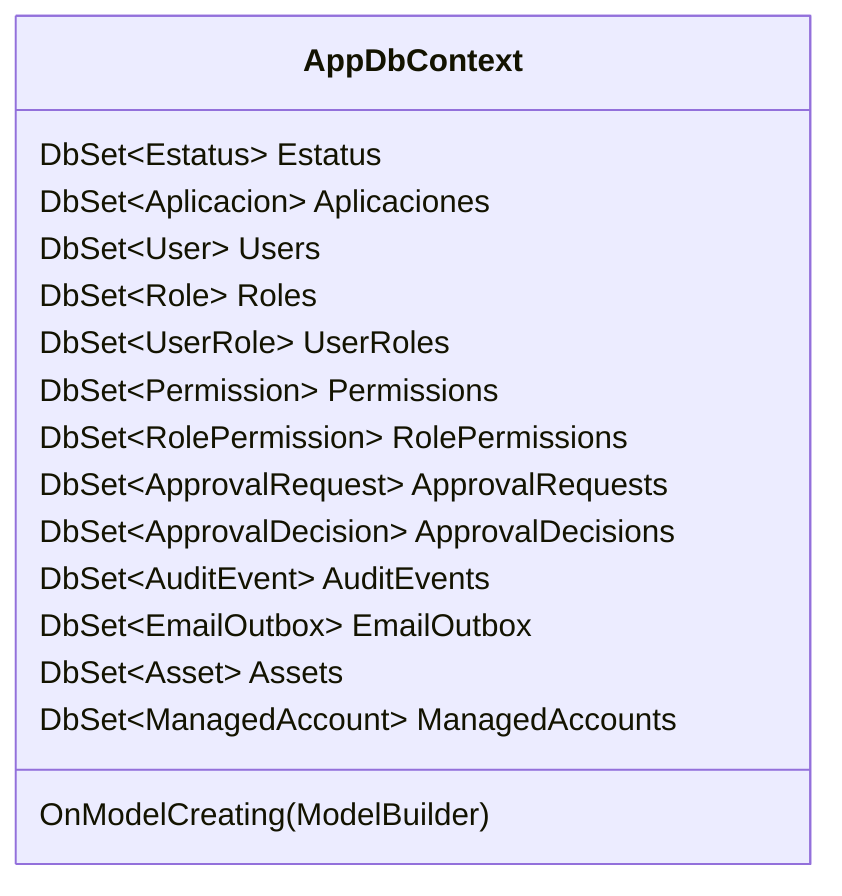

# Diagrama de clases

## Dominio (entidades)

```mermaid
classDiagram
    class Estatus { +Guid Id +string Nombre +long Codigo }
    class User { +Guid Id +string Username +string Nombre +string Apellido +string Email +ICollection~UserRole~ UserRoles }
    class Role { +Guid Id +string Nombre +ICollection~UserRole~ UserRoles +ICollection~RolePermission~ RolePermissions }
    class Permission { +Guid Id +string Code +string Description }
    class UserRole { +Guid UserId +Guid RoleId +User User +Role Role }
    class RolePermission { +Guid RoleId +Guid PermissionId +Role Role +Permission Permission }
    class Aplicacion { +Guid Id +string Nombre +Guid EstatusId +Estatus Estatus +Guid? AlojamientoId +Guid? PropietarioId +Guid? ResponsableId }
    class Aprobacion { +Guid Id +string Modulo +Guid EntidadId +string Estado +string Comentario +Guid? UsuarioId +DateTime Fecha }
    class AuditLog { +Guid Id +string Tabla +Guid EntidadId +string Accion +Guid? UsuarioId +DateTime Fecha +string Detalle }
    class ApprovalRequest { +Guid Id +string EntityType +string EntityId +Guid? AreaId +string Status +Guid? SubmittedByUserId +DateTime SubmittedAt +int CurrentStep +string Summary }
    class ApprovalDecision { +Guid Id +Guid ApprovalRequestId +string Decision +string Comment +Guid? DecidedByUserId +DateTime DecidedAt }
    class AuditEvent { +Guid Id +string EntityType +string EntityId +string Action +Guid? PerformedByUserId +DateTime PerformedAt +string BeforeJson +string AfterJson +string Comment +string CorrelationId }
    class EmailOutbox { +Guid Id +string To +string Subject +string BodyHtml +DateTime CreatedAt +DateTime? SentAt +string Status +string Error +int RetryCount }
    class Asset { +Guid Id +Guid OfficeId +Guid AreaId +string DeviceType +string Hostname +Guid StatusId +string ApprovalStatus }
    class ManagedAccount { +Guid Id +Guid? AreaId +string Responsible +string AccountName +int AccountType }
    class ManagedAccountSecurityGroup { +Guid Id +Guid ManagedAccountId +string GroupName }

    User "1" --> "*" UserRole
    Role "1" --> "*" UserRole
    Role "1" --> "*" RolePermission
    Permission "1" --> "*" RolePermission
    Estatus "1" --> "*" Aplicacion
    ApprovalRequest "1" --> "*" ApprovalDecision
```

## Servicios (interfaces e implementaciones)

```mermaid
classDiagram
    class ICurrentUserService { +Guid? UserId +string UserName +bool IsAdmin +bool CanSeeLogs +bool CanEdit(modulo) +Task~bool~ CanApproveModuloAsync(modulo) }
    class IAuditLogService { +Task RegistrarAsync(tabla, entidadId, accion, detalle, usuarioId) +Task~List~ GetLogsAsync(tabla, max) }
    class IExportService { +Task~byte[]~ ExportToExcelAsync(nombreModulo, datos) +Task~byte[]~ ExportToPdfAsync(nombreModulo, datos) +Task~byte[]~ ExportToCsvAsync(nombreModulo, datos) }
    class IEmailSender { +Task SendAsync(to, subject, bodyHtml) }
    class IAprobacionService { +Task~List~ GetAllAsync(modulo, max) +Task RegistrarAsync(modulo, entidadId, estado, comentario, usuarioId) +Task~bool~ MarcarAprobadoAsync(aprobacionId, usuarioId) }
    class IApprovalRequestService { +Task~ApprovalRequest~ CreateRequestAsync(entityType, entityId, areaId, submittedBy, summary) +Task~List~ GetPendingForUserAsync(userId) +Task~bool~ DecideAsync(requestId, approve, comment, userId) }

    CurrentUserService ..|> ICurrentUserService
    AuditLogService ..|> IAuditLogService
    ExportService ..|> IExportService
    AprobacionService ..|> IAprobacionService
```

## DbContext

```mermaid
classDiagram
    class AppDbContext {
        DbSet~Estatus~ Estatus
        DbSet~Aplicacion~ Aplicaciones
        DbSet~User~ Users
        DbSet~Role~ Roles
        DbSet~UserRole~ UserRoles
        DbSet~Permission~ Permissions
        DbSet~RolePermission~ RolePermissions
        DbSet~ApprovalRequest~ ApprovalRequests
        DbSet~ApprovalDecision~ ApprovalDecisions
        DbSet~AuditEvent~ AuditEvents
        DbSet~EmailOutbox~ EmailOutbox
        DbSet~Asset~ Assets
        DbSet~ManagedAccount~ ManagedAccounts
        OnModelCreating(ModelBuilder)
    }
```
