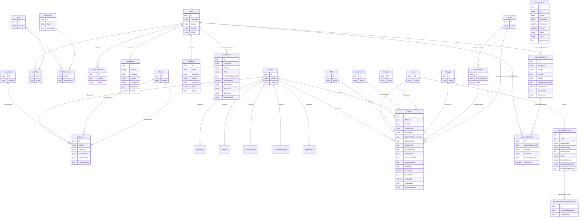

# Esquema de base de datos

## Diagrama ER (entidad-relación)

## Tablas

### Catálogos

| Tabla | Descripción |
|-------|-------------|
| Estatus | Activo, Inactivo, Desincorporado |
| Area | Aplicaciones, Telecomunicaciones, Operaciones, Soportes |
| Office | Oficina/ubicación |
| Environment | Ambiente |
| Criticality | Criticidad |
| Category | Categoría (activos) |
| Vendor | Fabricante/proveedor |
| DeviceModel | Modelo (FK a Vendor) |
| Alojamiento | Tipo de alojamiento (Data Center, Nube, etc.) |
| Parte | Partes interesadas: catálogo de propietarios y responsables de aplicaciones. Se usa en Aplicaciones (PropietarioId, ResponsableId). |

### Seguridad

| Tabla | Descripción |
|-------|-------------|
| Users | Usuarios (Username = DOMINIO\user o UPN) |
| Roles | SuperAdmin, Administrador, Operador, etc. |
| Permission | Códigos Perm.Inventory.Assets.View, etc. |
| UserRole | Usuario-Rol (N:M) |
| RolePermission | Rol-Permiso (N:M) |
| AprobacionPermiso | Usuario puede aprobar por módulo (Aplicaciones, Operaciones, Telecomunicaciones, Cuentas). Los permisos Perm.Inventory.Aplicaciones, Perm.Inventory.Operaciones, etc. controlan qué módulos ve cada usuario (Active Directory + BD). |

### Inventario

| Tabla | Descripción |
|-------|-------------|
| Aplicaciones | Catálogo de aplicaciones |
| Operaciones | Activos operaciones |
| Telecoms | Telecomunicaciones |
| CuentasServicio, CuentasPrivilegiadas | Cuentas de gestión (Nombre, Área, Responsable, Origen, ServicioRelacionado, Estatus) |
| CatalogItems | Catálogo genérico (Kind, Name) para TipoDispositivo, Función, TipoInfraestructura, SistemaOperativo — valores agregables "en el acto" |
| PaginasWeb | Páginas web (legacy; el módulo está unificado en Aplicaciones) |
| Asset | Activos (gestión de activos normalizada) |
| ManagedAccount | Cuentas de servicio/privilegiadas normalizadas |
| ManagedAccountSecurityGroup | Grupos de seguridad por cuenta |

### Aprobación y auditoría

| Tabla | Descripción |
|-------|-------------|
| Aprobaciones | Registro histórico de aprobaciones (legacy) |
| ApprovalRequest | Solicitud de aprobación (entidad, estado) |
| ApprovalDecision | Decisión (Aprobar/Rechazar) con comentario |
| AuditLog | Log técnico por tabla/entidad |
| AuditEvent | Trazabilidad funcional (Before/After JSON) |
| EmailOutbox | Cola de correos (Pending/Sent/Failed) |
